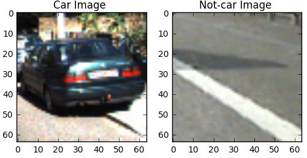
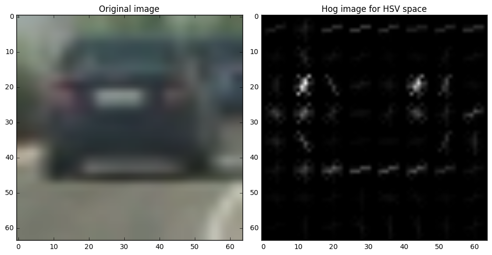
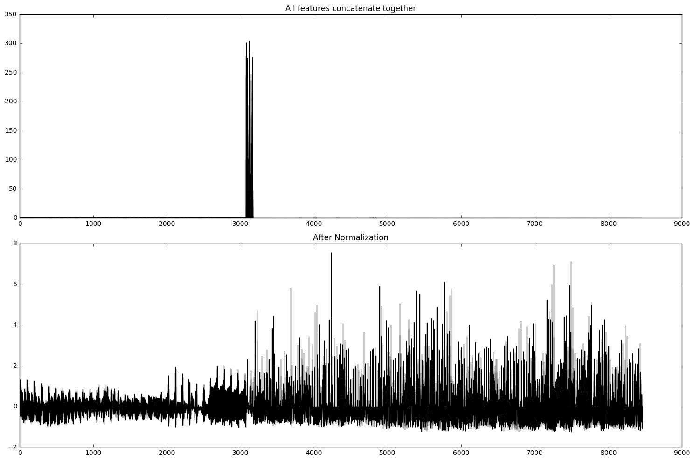
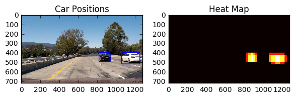
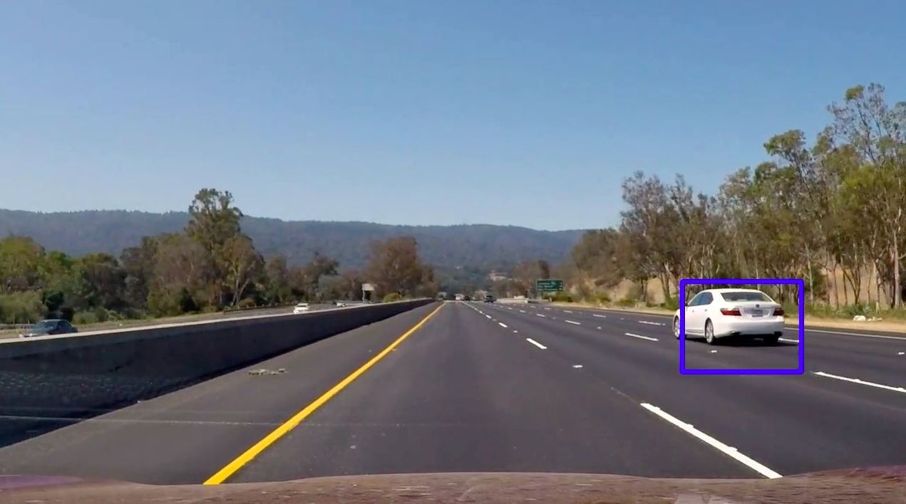

# P5 - Vehicle Detection Project

---
This is a project for Udacity self-driving car Nanodegree program. The aim of this project is to write a pipeline to detect vehicles in a video. The implementation of the project is in the file vehicle_detection.ipynb. 

In this project I used classic Computer Vision techniques, namely HOG features and SVM classifier. Although now deep learning is such a hot topic, this classic approach is valueable to me. I feel this project gave me a lot of insights by looking at different color spaces, doing weighted average of serise of images etc... With good feature extraction, even a simple linear SVM could do great job. 

---

###Procedures:
This project is mainly two parts:  
- Vehicle images and non-vehicle images **classification**  
- **Search** through video frame by frame to find cars with in sliding window. With some sanity checks.

#### Train a classifier

1. Prepare pre-labeled dataset e.g. resize to same scale
2. label cars and non-cars( try to make this dataset balance
3. Train validation split
4. Feature extraction
	- Color feature, try RBG, HSV etc... For example, in most road images, cars appear to be heavy saturation when comparing to the background
	- Gradient features, HOG, histogram of oriented gradients 
	- Normalize the features to avoid some features are in very large scale, becoming dominant features
5. Experientment with different classifier. Linear is fast, maybe SVM is more accurate. Or use ensemble method

Once I finised the training phase, and get a satisfied validation accuarcy. We are ready to load the video and search cars from there

#### Search 
1. Crop the image to keep only the road. Exclude the sky, billboard etc...
2. Sliding window technique
 	- Use different size of window 
 	- Extract HOG feature once for each image, and read by position for each sliding window to increase the speed
3. Mulitple detection due to sliding window and sizing. use incremental heatmap and apply threshold. 
4. False postive. Use continuous frames, if the classifier only recognize these pixels as car in one frame. Most likely its not a real car

---
###Train Classifier

####1. Extracted HOG features

The code for this step is contained in the first code cell of the IPython notebook.  

I started by reading in all the `vehicle` and `non-vehicle` images.  Here is an example of one of each of the `vehicle` and `non-vehicle` classes:  

I checked the class balance, car and non-car is almost 1:1, so this dataset is good for training.

I then explored different color spaces and different `get_hog_features()` parameters (`orient`, `pixels_per_cell`, and `cells_per_block`).  I grabbed random images from each of the two classes and displayed them to get a feel for what the `get_hog_features()` output looks like.

Here is an example using the `HSV` color space and HOG parameters of `orientations=8`, `pixels_per_cell=(8, 8)` and `cells_per_block=(2, 2)`:

This [github repo](https://github.com/asgunzi/CarND-VehicleDetection) has a detailed discussion of how HOG parameter changes will effect the feature extraction.
####2. Normalize different features
In this project I used color space features, HOG features. So it's very likely they are in different scale, in order to make the model not biased towards the larger variables, I scaled them in to comparable range using `sklearn.preprocessing.StandardScaler` function  

####3. Model tuning

I trained a SVM using grid search. It runs exhaust combin The parameters selected are those that maximize the score of the left out data

###Sliding Window Search

####1. Describe how (and identify where in your code) you implemented a sliding window search.  How did you decide what scales to search and how much to overlap windows?

I decided to search window using 3 different size. I keep the search window same, but shrink the video image by 1, 1.5 or 2. And I used 75% overlap. 

  
####2. Show some examples of test images to demonstrate how your pipeline is working.  What did you do to optimize the performance of your classifier?

Ultimately I searched on 3 scales using YCrCb 3-channel HOG features plus spatially binned color and histograms of color in the feature vector, which provided a nice result.  Here are some example images:

---

### Video Implementation

Here's a [link to my video result](./full_output.mp4)

#### False positives and Combining overlapping bounding boxes

I recorded the positions of positive detections in each frame of the video.  From the positive detections I created a heatmap and then thresholded that map to identify vehicle positions.  I then used `scipy.ndimage.measurements.label()` to identify individual blobs in the heatmap.  I then assumed each blob corresponded to a vehicle.  I constructed bounding boxes to cover the area of each blob detected.  

Here's an example result showing the heatmap from a series of frames of video, the result of `scipy.ndimage.measurements.label()` and the bounding boxes then overlaid on the last frame of video:

#### Stablize car boundaries
During seperate image, the box seems to be okay. However when I apply this onto an video, continuous frams has very similar car position, but due to thrshold, the heatmap boxes was very unstable.   
This could be improved by using a few frames average. In order to do this, I created class like P4. And keep track of last 10 frames. And took an average and apply threshold of 2. This stablized the boxes a little. However I still see lots of improvement potential in tuning it. 
#### Here are 10 frames and their corresponding heatmaps:

Here you can clearly see there's some "lag" which the box is actually larger than the car.

## Further improvements

The vehicle detection is clearly far from perfect as it is now! There are several parts of the pipeline which could be improved:  

* Image average method, threshold tuning might make the model more stable    
* The tracking is also rather simple and non-optimal, especially when vehicles passing over each other. I think color of vehicle could be one addition information to track. Also could use un-supervised clustering method to group similar car images. And create heat map seperately for each cluster.  
* This pipeline takes 40 minutes to find cars from a 50 seconds video clips. Clearly this speed is too slow for real-life self driving car probelm. 